# WBZ45x BLE (Central) to CAN Bridge using MCP251863


> "IoT Made Easy!" 

Devices: **| PIC32CXBZ2 | WBZ45x |**<br>
Features: **| CAN | BLE |**


## ⚠ Disclaimer

<p><span style="color:red"><b>
THE SOFTWARE ARE PROVIDED "AS IS" AND GIVE A PATH FOR SELF-SUPPORT AND SELF-MAINTENANCE. This repository contains example code intended to help accelerate client product development. </br>

For additional Microchip repos, see: <a href="https://github.com/Microchip-MPLAB-Harmony" target="_blank">https://github.com/Microchip-MPLAB-Harmony</a>

Checkout the <a href="https://microchipsupport.force.com/s/" target="_blank">Technical support portal</a> to access our knowledge base, community forums or submit support ticket requests.
</span></p></b>

## Harmony MCC Configuration<a name="step5">

| Tip | New users of MPLAB Code Configurator are recommended to go through the [overview](https://onlinedocs.microchip.com/pr/GUID-1F7007B8-9A46-4D03-AEED-650357BA760D-en-US-6/index.html?GUID-AFAB9227-B10C-4FAE-9785-98474664B50A) |
| :- | :- |

**Step 1** - Connect the WBZ451 CURIOSITY BOARD with MCP251863 CLICK and to the device/system using a micro-USB cable.

**Step 2** - Create a [new MCC Harmony project](https://github.com/MicrochipTech/EA71C53A/blob/master/H3/wireless_apps_pic32cxbz2_wbz45/apps/docs/creating_new_mplabx_harmony_project.md#creating-a-new-mcc-harmony-project).

**Step 3** - The "MCC - Harmony Project Graph" below depicts the harmony components utilized in this project.
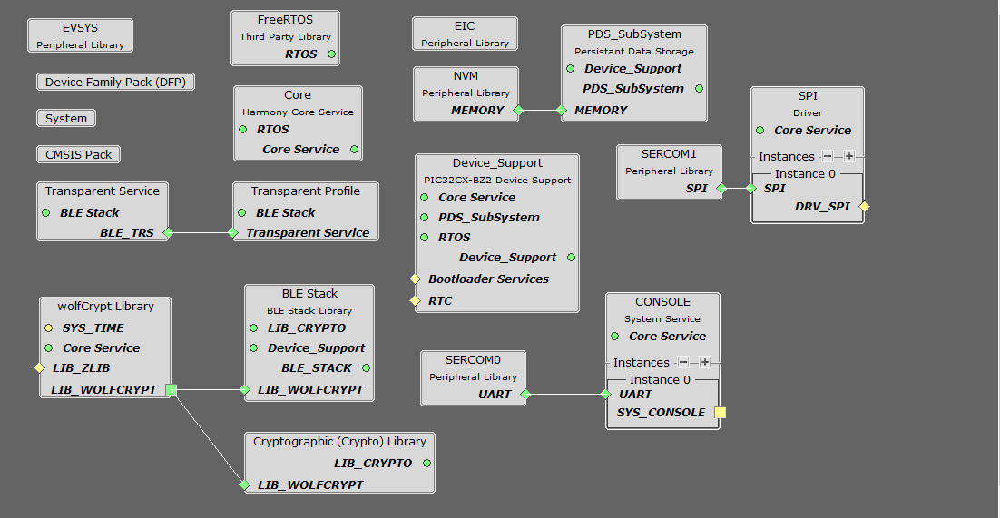

**Step 4** - In Device Resources, go to Harmony->wireless->drivers->BLE->Profiles and select Transparent Profile, then add to the project. Select "Yes" to accept dependencies.
- In Configuration Options for Transparent Profile, select Enable Client Role as shown below.\
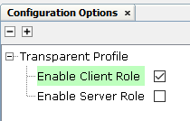

- Connect Transparent Profile to the Transparent Service as shown below.\
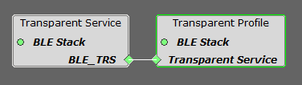

**Step 5** - In Device Resources, go to Harmony->Drivers->SPI. In configuration options for SPI, ensure Driver mode is set to Synchronous.
- Connect SPI to SERCOM1 as shown below.\
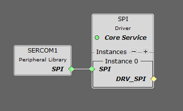

- In Configuration Options for SERCOM1, set the configuration as shown below.\
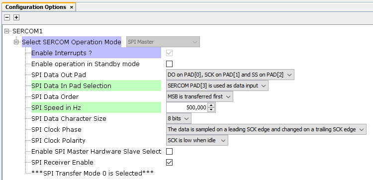

**Step 6** - In Device Resources, go to Harmony->System Services and select CONSOLE, then add to the project. Select "Yes" to accept dependencies.
- Connect CONSOLE to the SERCOM0 as shown below.\
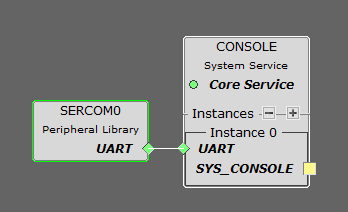

- In Configuration Options for SERCOM0, set the configuration as shown below.\
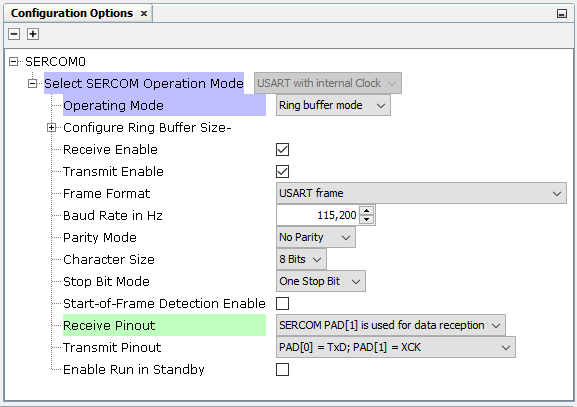

**Step 7** - In Device Resources, go to Harmony->Peripherals->EIC and select EIC, then add to the project.
- In Configuration Options for EIC, set the configuration as shown below.\
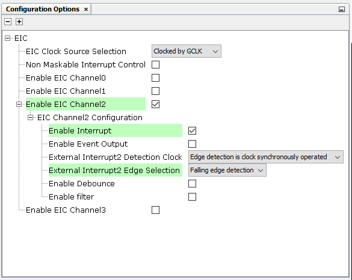

**Step 8** - Select BLE Stack in project graph. To configure the device BLE Central device and enable scanning, configure the BLE Stack in configuration options as shown below.\
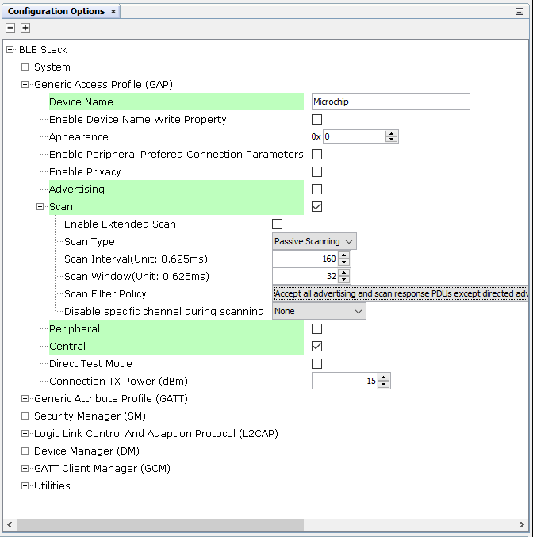

**Step 9** - In Project Graph->Plugins, select Pin Configuration.
- In Pin Configuration window, configure pins RA9, RB0, RB1, RB2, RB3, RB5 & RB7 as shown below.\
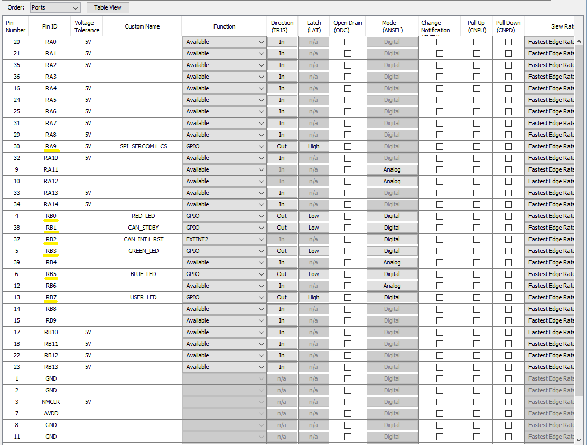

**Step 10** - Select System in project graph. In Configuration Options for System, expand DEVCFG1 and configure SERCOM0 Direct Pin Enable and SERCOM1 Direct Pin Enable as Direct Option as shown below.\
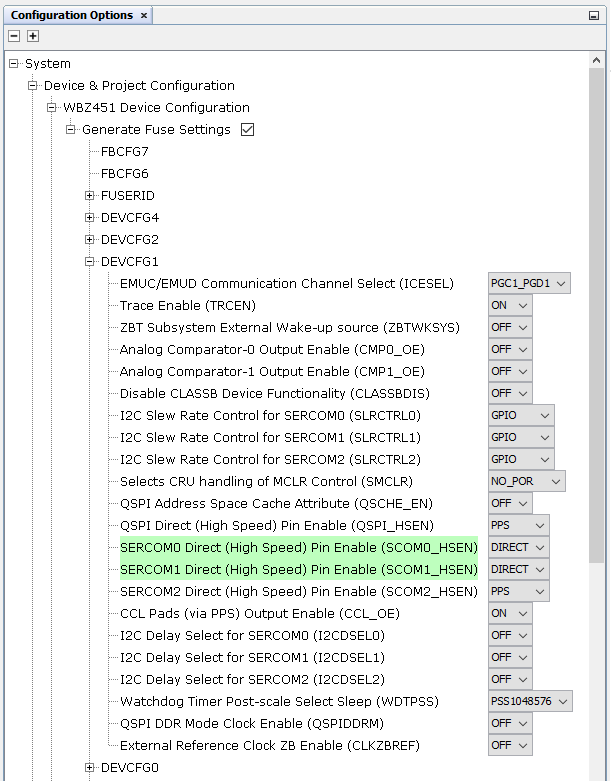

**Step 11** - [Generate](https://onlinedocs.microchip.com/pr/GUID-A5330D3A-9F51-4A26-B71D-8503A493DF9C-en-US-1/index.html?GUID-9C28F407-4879-4174-9963-2CF34161398E) the code.

**Step 12** - Place the canfdspi folder in src folder. In the project explorer, Right click on folder Source Files and add a sub folder canfdspi by selecting “Add Existing Items from Folders…”


- Click on “Add Folder…” button.\


- Select the “canfdspi” folder and select “Files of Types” as Source Files.\
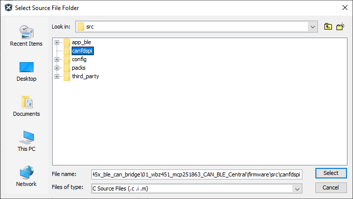

- In your MPLAB Harmony v3 based application go to "firmware\src\app_user_edits.c", make sure the below code line is commented after completing the required edits.

  - "#error User action required - manually edit files as described here".

- Update the app_ble_handler.c files as shown in the demo application.
	- Add following function in app_ble_handler.c and update BLE_GAP_EVT_CONNECTED, BLE_GAP_EVT_DISCONNECTED & BLE_GAP_EVT_ADV_REPORT as shown below.
```c
bool lookForServiceItemInAdvertisingString(uint8_t *adv, uint8_t advLength)
{
	uint8_t currentPos = 0;
	uint8_t sectionLength;
	uint16_t service_uuid, service_data;
	
	while(currentPos < advLength)
	{
		sectionLength = adv[currentPos];
		
		if( adv[currentPos+1] == AD_TYPE_SERVICE_ID)
		{
			service_uuid = ( adv[currentPos+2+1]<<8 | adv[currentPos+2]   );
			service_data = ( adv[currentPos+2+2]<<8 | adv[currentPos+2+3] );  

			if((service_uuid == AD_TYPE_SERVICE_UUID) && (service_data == AD_TYPE_SERVICE_DATA))
			{
				return true; 
			}
			else
			{
				currentPos += (sectionLength + 1);
			}
		}
		else
		{
			currentPos += (sectionLength + 1);
		}
			
		
	}
	return false;
}

```

```c
void APP_BleGapEvtHandler(BLE_GAP_Event_T *p_event)
{
    switch(p_event->eventId)
    {
        case BLE_GAP_EVT_CONNECTED:
        {
            conn_hdl = p_event->eventField.evtConnect.connHandle;
            USER_LED_Clear();
            SYS_CONSOLE_PRINT("[BLE]Connected\r\n");
            BLE_GAP_SetScanningEnable(false, BLE_GAP_SCAN_FD_DISABLE, BLE_GAP_SCAN_MODE_OBSERVER, 0);
        }
        break;

        case BLE_GAP_EVT_DISCONNECTED:
        {
            conn_hdl = 0xFFFF;
            BLE_GAP_SetScanningEnable(true, BLE_GAP_SCAN_FD_ENABLE, BLE_GAP_SCAN_MODE_OBSERVER, 100);
            USER_LED_Set();
            SYS_CONSOLE_PRINT("[BLE]Disconnected: 0x%x\r\n",p_event->eventField.evtDisconnect.reason);
        }
        break;

        case BLE_GAP_EVT_ADV_REPORT:
        {
            if(lookForServiceItemInAdvertisingString(p_event->eventField.evtAdvReport.advData,
                p_event->eventField.evtAdvReport.length) )
            {
                APP_Msg_T appMsg;
                appMsg.msgId = APP_MSG_BLE_CONN_EVT;
                memcpy(appMsg.msgData, &p_event->eventField.evtAdvReport.addr, sizeof(BLE_GAP_Addr_T));
                OSAL_QUEUE_Send(&appData.appQueue, &appMsg, 0);
            }
        }
        break;
```
- In app_trspc_handler.c file, update BLE_TRSPC_EVT_RECEIVE_DATA switch state in APP_TrspcEvtHandler() as shown below.
```c
void APP_TrspcEvtHandler(BLE_TRSPC_Event_T *p_event)
{
    switch(p_event->eventId)
    {
        case BLE_TRSPC_EVT_UL_STATUS:
        {
            /* TODO: implement your application code.*/
        }
        break;
        
        case BLE_TRSPC_EVT_DL_STATUS:
        {
            /* TODO: implement your application code.*/
        }            
        break;

        case BLE_TRSPC_EVT_RECEIVE_DATA:
        {
            APP_Msg_T appCANTxMsg;
            uint16_t data_len = 0;

            BLE_TRSPC_GetDataLength(p_event->eventField.onReceiveData.connHandle, &data_len);
            appCANTxMsg.msgData[0] = data_len;
            BLE_TRSPC_GetData(p_event->eventField.onReceiveData.connHandle, &appCANTxMsg.msgData[1]);

            appCANTxMsg.msgId = APP_MSG_BLE_RX_CAN_TX_EVT;
            OSAL_QUEUE_SendISR(&appData.appQueue, &appCANTxMsg);
        }            
        break;

        case BLE_TRSPC_EVT_VENDOR_CMD:
        {
            /* TODO: implement your application code.*/
        }            
        break;

        case BLE_TRSPC_EVT_VENDOR_CMD_RSP:
        {
            /* TODO: implement your application code.*/
        }            
        break;

        case BLE_TRSPC_EVT_DISC_COMPLETE:
        {
            /* TODO: implement your application code.*/
        }            
        break;

        case BLE_TRSPC_EVT_ERR_NO_MEM:
        {
            /* TODO: implement your application code.*/
        }
        break;

        default:
        break;
    }
}
```
- Update the app.c and app.h files as shown in the demo application.\
	- Add the following code in app.c file and update the APP_Tasks function with following code.\


```c
void CAN_Receive_Callback(void)
{
    APP_Msg_T appCANMsg;
    appCANMsg.msgId = APP_MSG_CAN_RECV_CB;
    OSAL_QUEUE_SendISR(&appData.appQueue, &appCANMsg);
}

void APP_ReceiveMessage_Tasks()
{
    APP_Msg_T appCANMsgQueue;
    CAN_MSG_t *canMsg = (CAN_MSG_t *)&appCANMsgQueue.msgData;
    CAN_RX_FIFO_EVENT rxFlags;

    DRV_CANFDSPI_ReceiveChannelEventGet(DRV_CANFDSPI_INDEX_0, APP_RX_FIFO, &rxFlags);
    if (rxFlags & CAN_RX_FIFO_NOT_EMPTY_EVENT)
    {
        DRV_CANFDSPI_ReceiveMessageGet(DRV_CANFDSPI_INDEX_0, APP_RX_FIFO, &canMsg->msgObj.rxObj, canMsg->can_data, MAX_DATA_BYTES);
#ifdef ENABLE_CONSOLE_PRINT
        SYS_CONSOLE_PRINT("New Message Received from CAN BUS\r\nMessage ID: 0x%X, DLC: 0x%X\r\nMessage: ", canMsg->msgObj.rxObj.bF.id.SID, canMsg->msgObj.rxObj.bF.ctrl.DLC);
        for(uint8_t i = 0; i<canMsg->msgObj.rxObj.bF.ctrl.DLC; i++)
        {
            SYS_CONSOLE_PRINT(" 0x%X",canMsg->can_data[i]);
        }
        SYS_CONSOLE_PRINT("\r\n\n");
#endif        
        appCANMsgQueue.msgId = APP_MSG_BLE_TX_CAN_RX_EVT;
        OSAL_QUEUE_Send(&appData.appQueue, &appCANMsgQueue, 0);
    }
}

void APP_CANFDSPI_Init()
{
    CAN_BITTIME_SETUP selectedBitTime = CAN_500K_2M;
    
    CAN_CONFIG config;
    CAN_TX_FIFO_CONFIG txConfig;
    CAN_RX_FIFO_CONFIG rxConfig;
    REG_CiFLTOBJ fObj;
    REG_CiMASK mObj;
    
    // Reset device
    DRV_CANFDSPI_Reset(DRV_CANFDSPI_INDEX_0);

    // Enable ECC and initialize RAM
    DRV_CANFDSPI_EccEnable(DRV_CANFDSPI_INDEX_0);

    if (!ramInitialized) {
        DRV_CANFDSPI_RamInit(DRV_CANFDSPI_INDEX_0, 0xFF);
        ramInitialized = true;
    }

    // Configure device
    DRV_CANFDSPI_ConfigureObjectReset(&config);
    config.IsoCrcEnable = 1;
    config.StoreInTEF = 0;

    DRV_CANFDSPI_Configure(DRV_CANFDSPI_INDEX_0, &config);

    // Setup TX FIFO
    DRV_CANFDSPI_TransmitChannelConfigureObjectReset(&txConfig);
    txConfig.FifoSize = 7;
    txConfig.PayLoadSize = CAN_PLSIZE_8;
    txConfig.TxPriority = 1;

    DRV_CANFDSPI_TransmitChannelConfigure(DRV_CANFDSPI_INDEX_0, APP_TX_FIFO, &txConfig);

    // Setup RX FIFO
    DRV_CANFDSPI_ReceiveChannelConfigureObjectReset(&rxConfig);
    rxConfig.FifoSize = 15;
    rxConfig.PayLoadSize = CAN_PLSIZE_8;

    DRV_CANFDSPI_ReceiveChannelConfigure(DRV_CANFDSPI_INDEX_0, APP_RX_FIFO, &rxConfig);

    // Setup RX Filter
    fObj.word = 0;
    fObj.bF.SID = 0xda;
    fObj.bF.EXIDE = 0;
    fObj.bF.EID = 0x00;

    DRV_CANFDSPI_FilterObjectConfigure(DRV_CANFDSPI_INDEX_0, CAN_FILTER0, &fObj.bF);

    // Setup RX Mask
    mObj.word = 0;
    mObj.bF.MSID = 0x0;
    mObj.bF.MIDE = 1; // Only allow standard IDs
    mObj.bF.MEID = 0x0;
    DRV_CANFDSPI_FilterMaskConfigure(DRV_CANFDSPI_INDEX_0, CAN_FILTER0, &mObj.bF);

    // Link FIFO and Filter
    DRV_CANFDSPI_FilterToFifoLink(DRV_CANFDSPI_INDEX_0, CAN_FILTER0, APP_RX_FIFO, true);

    // Setup Bit Time
    DRV_CANFDSPI_BitTimeConfigure(DRV_CANFDSPI_INDEX_0, selectedBitTime, CAN_SSP_MODE_AUTO, CAN_SYSCLK_40M);

    // Setup Transmit and Receive Interrupts
    DRV_CANFDSPI_GpioModeConfigure(DRV_CANFDSPI_INDEX_0, GPIO_MODE_INT, GPIO_MODE_INT);
    DRV_CANFDSPI_TransmitChannelEventEnable(DRV_CANFDSPI_INDEX_0, APP_TX_FIFO, CAN_TX_FIFO_NOT_FULL_EVENT);
    DRV_CANFDSPI_ReceiveChannelEventEnable(DRV_CANFDSPI_INDEX_0, APP_RX_FIFO, CAN_RX_FIFO_NOT_EMPTY_EVENT);
    DRV_CANFDSPI_ModuleEventEnable(DRV_CANFDSPI_INDEX_0, /*CAN_TX_EVENT |*/ CAN_RX_EVENT);

    // Select Normal Mode
    DRV_CANFDSPI_OperationModeSelect(DRV_CANFDSPI_INDEX_0, CAN_NORMAL_MODE);
    
    CAN_STDBY_Clear();
    EIC_CallbackRegister(EIC_PIN_2, (EIC_CALLBACK)CAN_Receive_Callback, 0);
    EIC_InterruptEnable(EIC_PIN_2);
}

void PrintBtAddress(uint8_t *addr)
{
    uint8_t i;
    SYS_CONSOLE_PRINT("Addr: ");
    for(i = 0; i < GAP_MAX_BD_ADDRESS_LEN; i++)
    {
        SYS_CONSOLE_PRINT("%02X",addr[5-i]);
    }
    SYS_CONSOLE_PRINT("\r\n");
}

bool APP_TestRamAccess(void)
{
    uint8_t rxd[MAX_DATA_BYTES];
    uint8_t txd[MAX_DATA_BYTES];
    
    for (uint8_t i = 0; i < MAX_DATA_BYTES; i++)
    {
        txd[i] = rand() & 0xff;
        rxd[i] = 0xff;
    }

    // Write data to RAM
    DRV_CANFDSPI_WriteByteArray(DRV_CANFDSPI_INDEX_0, cRAMADDR_START, txd, MAX_DATA_BYTES);

    // Read data back from RAM
    DRV_CANFDSPI_ReadByteArray(DRV_CANFDSPI_INDEX_0, cRAMADDR_START, rxd, MAX_DATA_BYTES);

    // Verify
    for (uint8_t i = 0; i < MAX_DATA_BYTES; i++)
    {
        if(txd[i] != rxd[i])
        {
            // Data mismatch
            return false;
        }

    }
    return true;
}

void APP_TransmitMessageQueue(CAN_MSG_t *canMsg)
{

    uint8_t attempts = MAX_TXQUEUE_ATTEMPTS;
    CAN_TX_FIFO_EVENT txFlags;
    uint8_t tec;
    uint8_t rec;
    CAN_ERROR_STATE errorFlags;

    // Check if FIFO is not full
    do {
        DRV_CANFDSPI_TransmitChannelEventGet(DRV_CANFDSPI_INDEX_0, APP_TX_FIFO, &txFlags);
        if (attempts == 0)
        {
            DRV_CANFDSPI_ErrorCountStateGet(DRV_CANFDSPI_INDEX_0, &tec, &rec, &errorFlags);
            SYS_CONSOLE_PRINT("[CAN] Tx Failed: 0x%X\r\n",errorFlags);
            return;
        }
        attempts--;
    }
    while (!(txFlags & CAN_TX_FIFO_NOT_FULL_EVENT));

    // Load message and transmit
    uint8_t n = DRV_CANFDSPI_DlcToDataBytes(canMsg->msgObj.txObj.bF.ctrl.DLC);

    DRV_CANFDSPI_TransmitChannelLoad(DRV_CANFDSPI_INDEX_0, APP_TX_FIFO, &canMsg->msgObj.txObj, canMsg->can_data, n, true);
    GREEN_LED_Clear();
#ifdef ENABLE_CONSOLE_PRINT
    SYS_CONSOLE_PRINT("New Message Received from BLE\r\nMessage ID: 0x%X, DLC: 0x%X\r\nMessage: ", canMsg->msgObj.txObj.bF.id.SID, canMsg->msgObj.txObj.bF.ctrl.DLC);
    for(uint8_t i = 0; i<canMsg->msgObj.txObj.bF.ctrl.DLC; i++)
    {
        SYS_CONSOLE_PRINT(" 0x%X",canMsg->can_data[i]);
    }
    SYS_CONSOLE_PRINT("\r\n[CAN] TX Done\r\n");
#endif
}

```
```c
/******************************************************************************
  Function:
    void APP_Tasks ( void )

  Remarks:
    See prototype in app.h.
 */

void APP_Tasks ( void )
{
    APP_Msg_T    appMsg[1];
    APP_Msg_T   *p_appMsg;
    p_appMsg=appMsg;

    /* Check the application's current state. */
    switch ( appData.state )
    {
        /* Application's initial state. */
        case APP_STATE_INIT:
        {
            bool appInitialized = true;
            //appData.appQueue = xQueueCreate( 10, sizeof(APP_Msg_T) );
            
            DRV_SPI_TRANSFER_SETUP setup;
            canSPIHandle = DRV_SPI_Open(DRV_SPI_INDEX_0, DRV_IO_INTENT_READWRITE);
            setup.baudRateInHz = 10000000;
            setup.clockPhase = DRV_SPI_CLOCK_PHASE_VALID_LEADING_EDGE;
            setup.clockPolarity = DRV_SPI_CLOCK_POLARITY_IDLE_LOW;
            setup.dataBits = DRV_SPI_DATA_BITS_8;
            setup.chipSelect = GPIO_PIN_RA9;
            setup.csPolarity = DRV_SPI_CS_POLARITY_ACTIVE_LOW;
            DRV_SPI_TransferSetup ( canSPIHandle, &setup );
            
            APP_BleStackInit();
            APP_CANFDSPI_Init();
            
            SYS_CONSOLE_MESSAGE("BLE - CAN Central Application\r\n");
            BLE_GAP_SetScanningEnable(true, BLE_GAP_SCAN_FD_ENABLE, BLE_GAP_SCAN_MODE_OBSERVER, 100);
            if (appInitialized)
            {
                appData.state = APP_STATE_TEST_RAM;
            }
            break;
        }
        case APP_STATE_TEST_RAM:
        {
            if(APP_TestRamAccess())
            {
                SYS_CONSOLE_PRINT("RAM Test: Passed\r\n");
            }
            else
            {
                SYS_CONSOLE_PRINT("RAM Test: Failed\r\n");
            }
            appData.state = APP_STATE_SERVICE_TASKS;
            break;
        }
        case APP_STATE_SERVICE_TASKS:
        {
            if (OSAL_QUEUE_Receive(&appData.appQueue, &appMsg, OSAL_WAIT_FOREVER))
            {
                if(p_appMsg->msgId==APP_MSG_BLE_STACK_EVT)
                {
                    // Pass BLE Stack Event Message to User Application for handling
                    APP_BleStackEvtHandler((STACK_Event_T *)p_appMsg->msgData);
                }
                else if(p_appMsg->msgId==APP_MSG_BLE_STACK_LOG)
                {
                    // Pass BLE LOG Event Message to User Application for handling
                    APP_BleStackLogHandler((BT_SYS_LogEvent_T *)p_appMsg->msgData);
                }
                else if(p_appMsg->msgId==APP_MSG_BLE_CONN_EVT)
                {
                    BLE_GAP_Addr_T devAddr;
                    BLE_GAP_CreateConnParams_T createConnParam_t;
                    
                    memcpy(&devAddr, &p_appMsg->msgData, sizeof(BLE_GAP_Addr_T));
                    SYS_CONSOLE_MESSAGE("Found BLE CAN Peripheral Device - ");
                    PrintBtAddress(devAddr.addr);
                    
                    createConnParam_t.scanInterval = 0x3C; // 37.5 ms 
                    createConnParam_t.scanWindow = 0x1E; // 18.75 ms
                    createConnParam_t.filterPolicy = BLE_GAP_SCAN_FP_ACCEPT_ALL;
                    createConnParam_t.peerAddr.addrType = devAddr.addrType;
                    memcpy(createConnParam_t.peerAddr.addr, devAddr.addr, GAP_MAX_BD_ADDRESS_LEN);
                    createConnParam_t.connParams.intervalMin = 0x10; // 20ms
                    createConnParam_t.connParams.intervalMax = 0x10; // 20ms
                    createConnParam_t.connParams.latency = 0;
                    createConnParam_t.connParams.supervisionTimeout = 0x48; // 720ms
                    BLE_GAP_CreateConnection(&createConnParam_t);   
                }
                else if (p_appMsg->msgId==APP_MSG_CAN_RECV_CB)
                {
                    BLUE_LED_Set();
                    APP_ReceiveMessage_Tasks();
                }
                else if(p_appMsg->msgId==APP_MSG_BLE_TX_CAN_RX_EVT)
                {
                    BLUE_LED_Clear();
                    CAN_MSG_t *canMsg = (CAN_MSG_t *)&p_appMsg->msgData;
                    uint8_t size = sizeof(CAN_RX_MSGOBJ) + canMsg->msgObj.rxObj.bF.ctrl.DLC;
                    BLE_TRSPC_SendData(conn_hdl, size, p_appMsg->msgData);
                }
                else if (p_appMsg->msgId==APP_MSG_BLE_RX_CAN_TX_EVT)
                {
                    GREEN_LED_Set();
                    CAN_MSG_t *canMsg = (CAN_MSG_t *)&p_appMsg->msgData[1];
                    APP_TransmitMessageQueue(canMsg);
                }
            }
            break;
        }

        /* TODO: implement your application state machine.*/


        /* The default state should never be executed. */
        default:
        {
            /* TODO: Handle error in application's state machine. */
            break;
        }
    }
}
```

- Update app.h as shown below.
```c
#define MAX_TXQUEUE_ATTEMPTS        10
#define DRV_CANFDSPI_INDEX_0        canSPIHandle

    // Transmit Channels
#define APP_TX_FIFO CAN_FIFO_CH2

// Receive Channels
#define APP_RX_FIFO CAN_FIFO_CH1

typedef enum
{
    /* Application's state machine's initial state. */
    APP_STATE_INIT=0,
    APP_STATE_SERVICE_TASKS,
    APP_STATE_TEST_RAM,

} APP_STATES;

typedef enum APP_MsgId_T
{
    APP_MSG_BLE_STACK_EVT,
    APP_MSG_BLE_STACK_LOG,
    APP_MSG_ZB_STACK_EVT,
    APP_MSG_ZB_STACK_CB,
    APP_MSG_BLE_CONN_EVT,
    APP_MSG_CAN_RECV_CB,
    APP_MSG_BLE_TX_CAN_RX_EVT,
    APP_MSG_BLE_RX_CAN_TX_EVT,
    APP_MSG_STACK_END
} APP_MsgId_T;
```

- In APP_BleConfigBasic() function in app_ble.c file, add the following code as shown below.
```c
void APP_BleConfigBasic()
{

    BLE_GAP_Addr_T devAddr;
    if (!IB_GetBdAddr(&devAddr.addr[0]) )
    {
        devAddr.addrType = BLE_GAP_ADDR_TYPE_PUBLIC;
    devAddr.addr[5] = 0xC1;
    devAddr.addr[4] = 0xC2;
    devAddr.addr[3] = 0xC3;
    devAddr.addr[2] = 0xC4;
    devAddr.addr[1] = 0xC5;
    devAddr.addr[0] = 0xC6;

        // Configure device address
        BLE_GAP_SetDeviceAddr(&devAddr);
    }


```

**Step 13** - Clean and build the project. To run the project, select "Make and program device" button.

