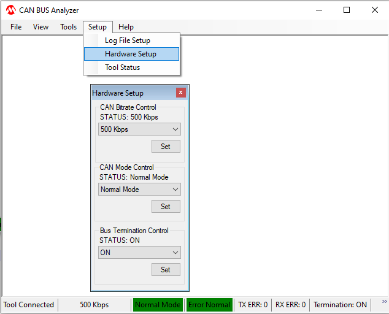

# PIC32CXBZ2_WBZ45x BLE to CAN Bridge using MCP251863

> "IoT Made Easy!" 

Devices: **| PIC32CXBZ2 | WBZ45x |** 
Features: **| CAN | BLE |**

## ⚠ Disclaimer

<b>
THE SOFTWARE ARE PROVIDED "AS IS" AND GIVE A PATH FOR SELF-SUPPORT AND SELF-MAINTENANCE. This repository contains example code intended to help accelerate client product development.  

For additional Microchip repos, see: <a href="https://github.com/Microchip-MPLAB-Harmony" target="_blank">https://github.com/Microchip-MPLAB-Harmony</a>

Checkout the <a href="https://microchipsupport.force.com/s/" target="_blank">Technical support portal</a> to access our knowledge base, community forums or submit support ticket requests.

</b>

## Contents

1. [Introduction](#step1)
1. [Bill of materials](#step2)
1. [Hardware Setup](#step3)
1. [Software Setup](#step4)
1. [Harmony MCC Configuration](#step5)
1. [Board Programming](#step6)
1. [Run the demo](#step7)

## 1. Introduction<a name="step1">

This application serves as an illustration of how to extend a CAN network wirelessly using BLE.\

The CAN-BLE Central Device connects to the CAN-BLE Peripheral Device and establishes a BLE link using Microchip's proprietary Transparent UART Profile for data transfer.

The Microchip CAN Bus Analyzer tool is used in this example to simulate transmitting and receiving CAN messages from a CAN network.
Alternatively, the CAN-BLE peripheral device can be connected to a mobile application to visualize the CAN messages on a mobile phone.

## 2. Bill of materials<a name="step2">

| TOOLS | QUANTITY |
| :- | :- |
| [PIC32CX-BZ2 and WBZ451 Curiosity Development Board](https://www.microchip.com/en-us/development-tool/EV96B94A) | 2 |
| [MCP251863 CLICK](https://www.mikroe.com/mcp251863-click) | 2 |
| [CAN BUS ANALYZER TOOL](https://www.microchip.com/en-us/development-tool/APGDT002) | 2 |
| DB9 Connector | 2 |

## 3. Hardware Setup<a name="step3">

| WBZ451 | MCP251863 CLICK | Description        |    | WBZ451 | MCP251863 CLICK | Description |
| :-     | :-              | :-                 | :- | :-     | :-              | :-          |
| AN     | 1(STB)          | StandBy Control    |    | PWM    | NC              | NC          |
| RST    | 13(IN1)         | RX Interrupt       |    | INT    | NC              | NC          |
| CS     | 3(CS)           | CHIP SELECT        |    | RX     | NC              | NC          |
| SCK    | 4(SCK)          | SPI CLOCK          |    | TX     | NC              | NC          |
| MISO   | 5(MISO)         | SERIAL DATA OUTPUT |    | SCL    | NC              | NC          |
| MOSI   | 6(MOSI)         | SERIAL DATA INPUT  |    | SDA    | NC              | NC          |
| 3.3V   | 7(3.3V)         | POWER SUPPLY       |    | 5V     | 5V              | 5V POWER SUPPLY |
| GND    | 8 (GND)         | GROUND             |    | GND    | GND             | GROUND      |

## 4. Software Setup<a name="step4">

- [MPLAB X IDE ](https://www.microchip.com/en-us/tools-resources/develop/mplab-x-ide#tabs)

    - Version: 6.05
	- XC32 Compiler v4.10
	- MPLAB® Code Configurator v5.2.1
	- PIC32CX-BZ_DFP v1.0.107
	- MCC Harmony
	  - csp version: v3.14.0
	  - core version: v3.11.1
	  - CMSIS-FreeRTOS: v10.4.6
	  - wireless_pic32cxbz_wbz: v1.1.0
	  - dev_packs: v3.14.0
	  - wolfssl version: v4.7.0
	  - crypto version: v3.7.6
	  - wireless_ble: v1.0.0
	    
- [Microchip CAN BUS Analyzer V2.3] (https://ww1.microchip.com/downloads/en/DeviceDoc/Microchip%20CAN%20BUS%20Analyzer%20v2.3%20Installer.zip)

- Any Serial Terminal application like [TERA TERM](https://download.cnet.com/Tera-Term/3000-2094_4-75766675.html) terminal application

- [MPLAB X IPE v6.05](https://microchipdeveloper.com/ipe:installation)

## 5. Harmony MCC Configuration<a name="step5">

- CAN-BLE Central Device

	Refer the documentation available in [01_wbz451_mcp251863_CAN_BLE_Central](01_wbz451_mcp251863_CAN_BLE_Central/readme.md)
 
- CAN-BLE Peripheral Device

	Refer the documentation available in [02_wbz451_mcp251863_CAN_BLE_Peripheral](02_wbz451_mcp251863_CAN_BLE_Peripheral/readme.md)

## 6. Board Programming<a name="step6">

## Programming hex file:

### Program the precompiled hex file using MPLAB X IPE

- The Precompiled hex file is given in the hex folder.
Follow the steps provided in the link to [program the precompiled hex file](https://microchipdeveloper.com/ipe:programming-device) using MPLABX IPE to program the pre-compiled hex image. 

### Build and program the application using MPLAB X IDE

The application folder can be found by navigating to the following path: 

- CAN-BLE Central Device
	- "01_wbz451_mcp251863_CAN_BLE_Central\firmware\bleCan_Central.X"
- CAN-BLE Peripheral Device	
	- "02_wbz451_mcp251863_CAN_BLE_Peripheral\firmware\bleCan_Peripheral.X"

Follow the steps provided in the link to [Build and program the application](https://github.com/Microchip-MPLAB-Harmony/wireless_apps_pic32cxbz2_wbz45/tree/master/apps/ble/advanced_applications/ble_sensor#build-and-program-the-application-guid-3d55fb8a-5995-439d-bcd6-deae7e8e78ad-section).

## 7. Run the demo<a name="step7">

## Running Demo as CAN BLE Bridge

- Program a WBZ451 Curiosity board with bleCan_Central application and other with WBZ451 Curiosity board with bleCan_Peripheralapplication.
- Connect MCP251863 CLICK to Mikroe Header in WBZ451 Curiosity board as per the [Hardware Setup](#step3)
- Connect [CAN BUS ANALYZER TOOL](https://www.microchip.com/en-us/development-tool/APGDT002) to MCP251863 CLICK board using a DB9 Connector as shown in the figure.

- The transmission and receipt of CAN messages from a CAN network are recreated using the Microchip CAN Bus Analyzer tool.
- Open Microchip CAN Bus Analyzer tool, in 'Setup --> Hardware Setup', Configure the CAN Bitrate Control, CAN Mode Control and Bus Termination Control as shown below figure.\

- Open Rolling Trace window from 'Tools --> Rolling Trace' to view the transmitted and received data.

- Open Transmit Window from 'Tools --> Transmit' to transmit data from CAN Bus Analyzer Tool.
- Configure the Transmit window as shown in the below figure.

- Similarly Open another instance of Microchip CAN Bus Analyzer tool and configure the tool as mentioned in above steps
- Click on Send Button in Transmit window to send the data from CAN
- Observe the data is being received on other instance of CAN Analyzer
- The below video shows the working of the CAN-BLE bridge.

## Connecting CAN Network to Mobile App (MBD App)

- Program a WBZ451 Curiosity board with bleCan_Peripheralapplication.
- Connect MCP251863 CLICK to Mikroe Header in WBZ451 Curiosity board as per the [Hardware Setup](#step3)
- Connect [CAN BUS ANALYZER TOOL](https://www.microchip.com/en-us/development-tool/APGDT002) to MCP251863 CLICK board using a DB9 Connector as shown in the [figure](Docs/can_ble_setup.png).
- Open Microchip MBD Application on Mobile phone and click on BLE Smart to scan for the available devices.

- The MBD App will scan for the available devices and the scan result will be shown as below. Select "CAN BLE Bridge Device" from the scan list.

- Click on the Connect button to establish a BLE Connection with the device.

- Once BLE Connection is established and service discovery is completed, Transparent UART Service is discovered and shown as Microchip Data Service as shown below.

- To view the CAN messages transmitted via BLE, select the Transparent UART TX Characteristic (UUID ending with 9616) as shown below.

- In the Characteristics page, enable notify/indicate as shown below.

- Open CAN Bus Analyzer Tool and set Transmit window as shown below and click on the send button.

- The MBD App will show the received messages as shown below.

- The below video shows the working of the CAN-BLE bridge using MBD application.

